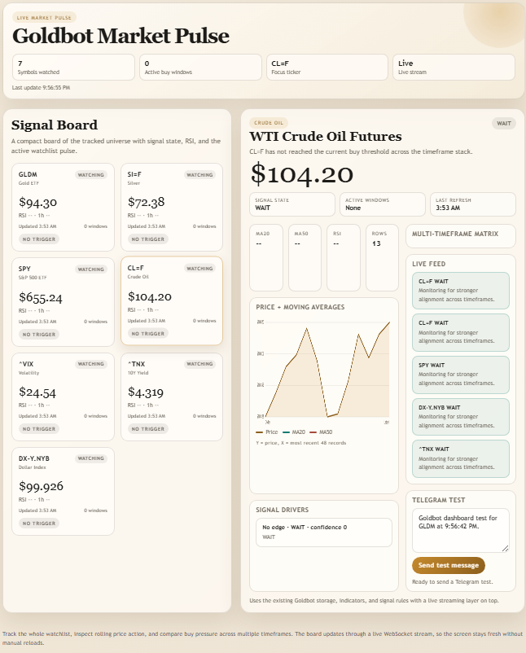
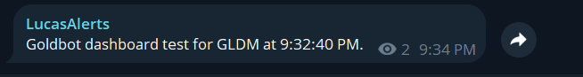

# Goldbot

Goldbot is a small market watcher with two Python apps:

- `bot/` collects Yahoo Finance prices, stores them in MySQL, and sends Telegram alerts.
- `web/` serves a FastAPI dashboard with charts, multi-timeframe signals, live updates, and a Telegram test tool.

## Screenshots

### Dashboard

### Telegram Test

## Project Structure

- `bot/` background collector and alert logic
- `web/` dashboard and API
- `bot/schema.sql` database schema

## Quick Start

1. Create a Python environment.
2. Install dependencies:
   `pip install -r bot/requirements.txt`
   `pip install -r web/requirements.txt`
3. Create the MySQL database:
   `CREATE DATABASE goldbot;`
4. Apply the schema:
   `mysql -u root -p goldbot < bot/schema.sql`
5. Copy `bot/config.sample.py` to `bot/config_local.py` and fill in your local secrets.
   You can also use environment variables such as `GOLDBOT_DB_PASSWORD`, `GOLDBOT_TELEGRAM_TOKEN`, and `GOLDBOT_CHAT_ID`.
6. Start the bot:
   `python -m bot.bot`
7. Start the web app:
   `uvicorn web.api:app --host 0.0.0.0 --port 8009`

## Main Features

- Continuous market polling for the configured symbols
- MySQL-backed price and signal storage
- Telegram alert delivery
- Dashboard with live WebSocket updates
- Bot health and runtime status panel
- Multi-timeframe buy signal analysis
- Configurable signal thresholds
- Telegram test panel in the web UI
- Basic automated tests for signal/config behavior

## Telegram Setup

1. Create a bot with BotFather and copy the bot token.
2. Put the token in `bot/config_local.py` as `TELEGRAM_TOKEN`, or set `GOLDBOT_TELEGRAM_TOKEN`.
3. Open a direct chat with the bot, or add it to the target group or channel.
4. Send a message like `hi` so Telegram creates an update for that chat.
5. Check updates with:
   `https://api.telegram.org/bot<YOUR_TOKEN>/getUpdates`
6. Copy the real `chat.id` value into `CHAT_ID`.

Telegram notes:

- Direct chats usually use a positive `chat.id`.
- Groups and channels usually use a negative `chat.id`.
- Channels and supergroups often use the full `-100...` id. Do not trim that prefix.
- If `getUpdates` returns `{"ok":true,"result":[]}`, the bot has not received a message yet.
- If sending fails with `Bad Request: chat not found`, the `CHAT_ID` is wrong or the bot is not in that chat.

## Config Standard

- `bot/config.py` is tracked and contains safe defaults only.
- `bot/config.sample.py` is the template you copy for local setup.
- `bot/config_local.py` is ignored by Git and is the right place for local secrets.
- `BOT_RULES` and `BUY_SIGNAL_RULES` let you tune thresholds without editing strategy code.
- The web app reads the same shared bot config.
- The Telegram test endpoint will fail until `TELEGRAM_TOKEN` and `CHAT_ID` point to a valid chat for the bot.
- Run commands from the repository root for the cleanest import behavior.

## Tests

Run the current smoke tests from the repository root:

`python -m unittest discover -s tests -v`
